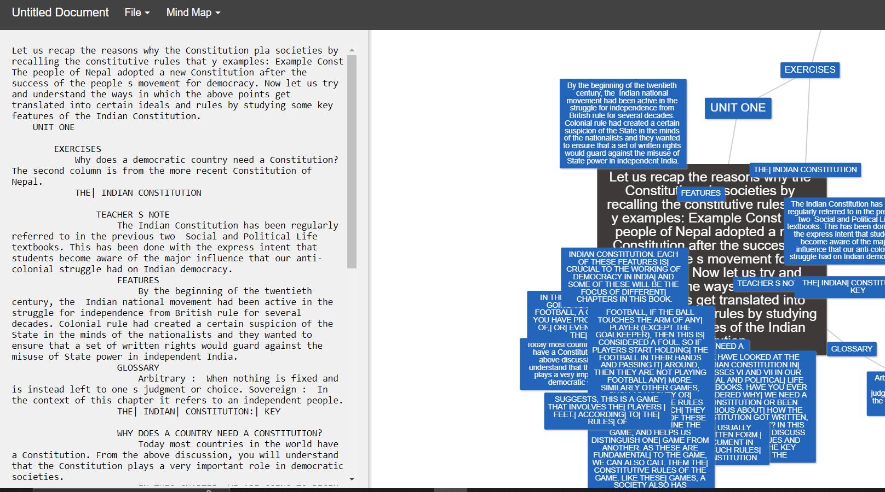

Automatically create visual mindmap based on input PDF
 
Uses Google's BERT summarizer at core to generate appropriate sized summaries at each level.  

## Steps

- Place input as txt in feedstr.txt or as pdf (change name in input)
- `python main.py`
- run the `mindmap` in `ui` folder and paste the output of python program there

